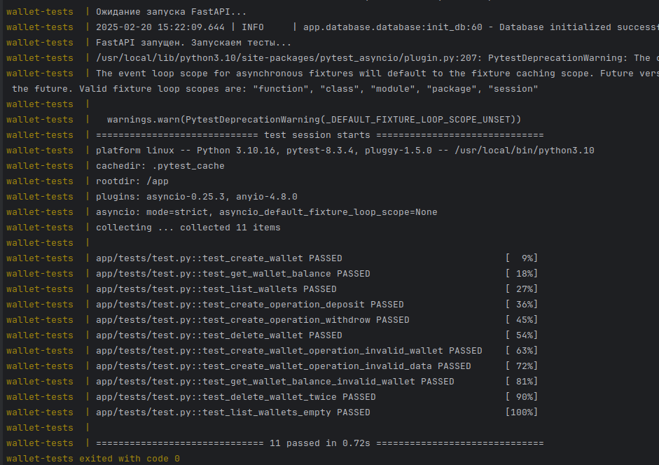
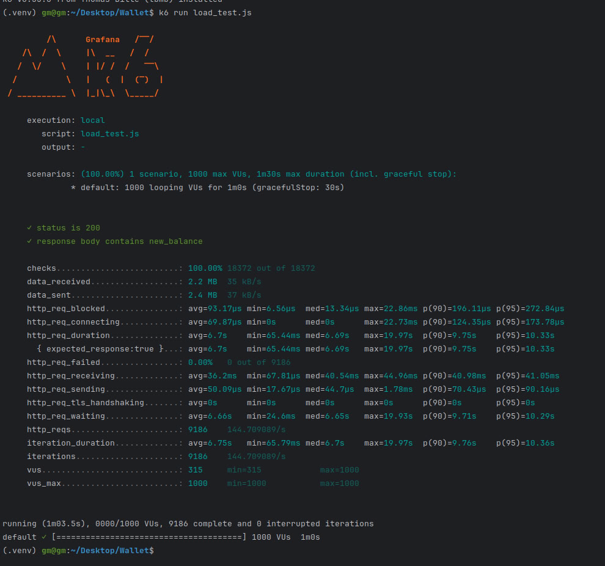
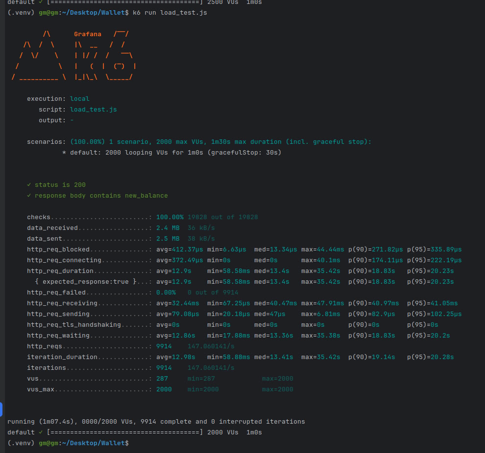
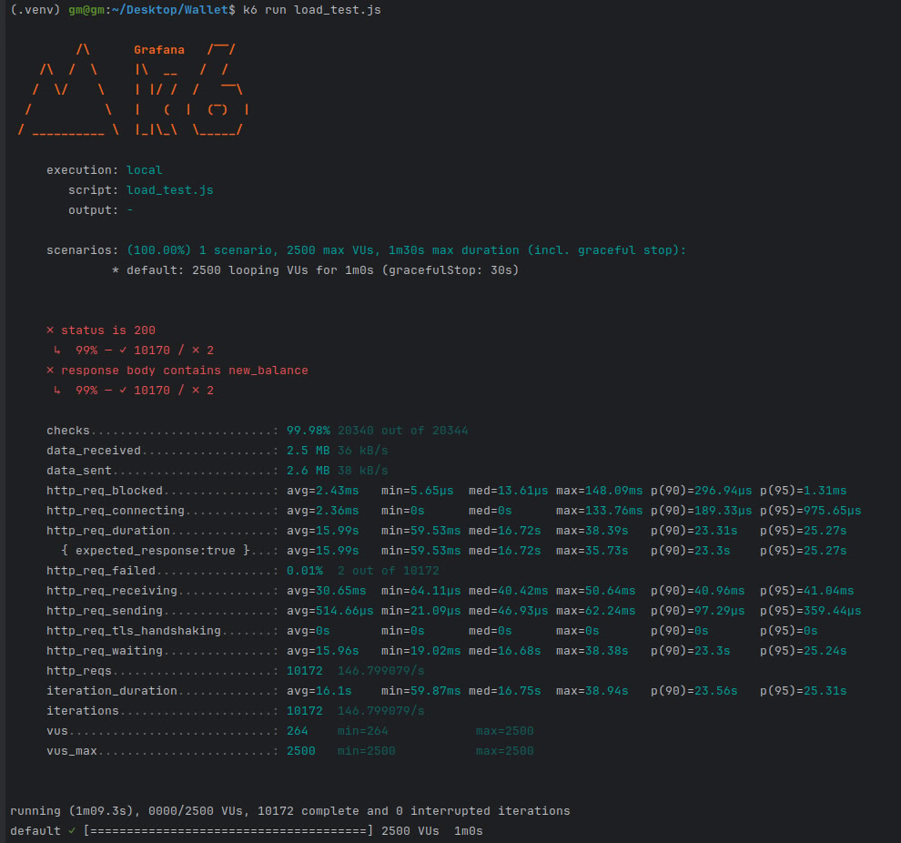

# API для управления кошельками

Этот проект представляет собой API, созданное с использованием FastAPI, для управления кошельками и выполнения операций, таких как депозиты и снятие средств. 
Проект взаимодействует с базой данных для хранения информации о кошельках и предоставляет различные конечные точки для создания, просмотра и удаления кошельков.
[Тестовое задание Python.pdf](./'Тестовое задание Python.pdf')


## Требования

- Python 3.7 или выше
- Зависимости, указанные в `requirements.txt`

## Сборка и запуск

Построение Docker образов для сервисов

```bash
docker compose -f docker-compose.yml build
```

Запуск приложения через Docker compose

```bash
docker compose -f docker-compose.yml up
```
Теперь приложение доступно по адресу http://localhost:8001.

Построение Docker образов для сервисов

```bash
docker compose -f docker-compose-tests.yml build
```

Запуск тестов через Docker compose

```bash
docker compose -f docker-compose-tests.yml up
```
Результатом является успешное прохождение тестов


API route
1. Создание нового кошелька
Метод: POST /api/v1/wallets/
Описание: Создаёт новый кошелёк с начальным балансом и возвращает его UUID.
2. Получение баланса кошелька
Метод: GET /api/v1/wallets/{wallet_uuid}
Описание: Получает баланс указанного кошелька по его UUID.
3. Список всех кошельков
Метод: GET /api/v1/wallets/
Описание: Возвращает список всех кошельков с их балансами.
4. Создание операции на кошельке (депозит/снятие)
Метод: POST /api/v1/wallets/{wallet_uuid}/operation
Описание: Выполняет операцию депозита или снятия средств для указанного кошелька.
5. Удаление кошелька
Метод: DELETE /api/v1/wallets/{wallet_uuid}
Описание: Удаляет кошелек по UUID.

## Для запуска простейшего нагрузочного тестирования 

```bash
k6 run load_test.js
```
Настройка параметров тестирования производится через изменение прараметров скрипта:
```bash
export let options = {
  vus: 2000, // количество виртуальных пользователей
  duration: '1m', // продолжительность теста
  rps: 2000, // максимальное количество запросов в секунду
};
```

Результатом является вывод:



